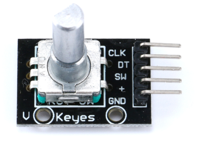

## EC11 旋转编码器
`EC11` 是常用的一种作为单片机输入的方式，它可以旋转和按下，我们可以判断旋转的方向和是否按下。




EC11 有3个 IO 口，分别为 CLK、DT、SW，CLK和DT为旋转脉冲，SW为按钮。3个IO通过3个上拉电阻连到电源（+），所以默认3个IO都为高电平。

## 按钮按下判断
通过判断 `SW` 是否为低电平可以判断按钮是否按下，配置为外部中断下降沿出发。然后在中断中判断即可，不过由于机械震动，在我们按下时就会产生多个脉冲，这是我们不想发生的事情。所以我们要加上消抖功能。

GD32 单片机有一个1ms(毫秒)滴答定时器，我们消抖一般需要 10ms 的延时。所以我们定义一个按钮按下的标志位 `ec11_sw_flag`，默认为 0，当 SW 产生下降沿中断时让 `ec11_sw_flag=1`。后面会用到这个标志。

在 `SysTick_Handler()` 系统滴答处理函数中判断 `ec11_sw_flag` 是否为 1，如果为 1则让 `ec11_sw_time_count++`，ec11_sw_time_count 需要我们定义，定义成 uint8_t 即可，因为我们只要延时 10毫秒即可。

然后定义一个 `ec11_encoder_handle(void)` 函数，该函数在`while(1){ec11_encoder_handle();}`一直轮询。

```c
void encoder_handle(void)
{
    if(ec11_sw_time_count>10)
    {
        /* 10ms 后再次查询 SW IO 的电平 */
        FlagStatus SW_State = gpio_input_bit_get(ENCODER_SW_GPIO_PORT, ENCODER_SW_PIN);
        if(SW_State == SET)
        {
            test_number++;
            exti_ec11_sw_flag = 0;
            time_xd_sw = 0;
        }
    }
}
```

