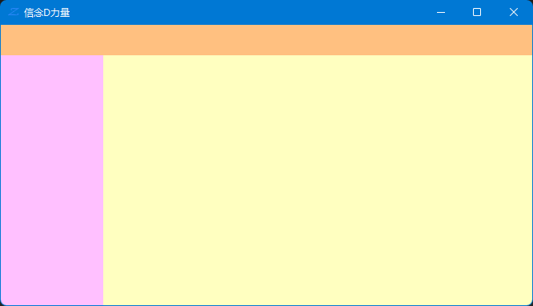
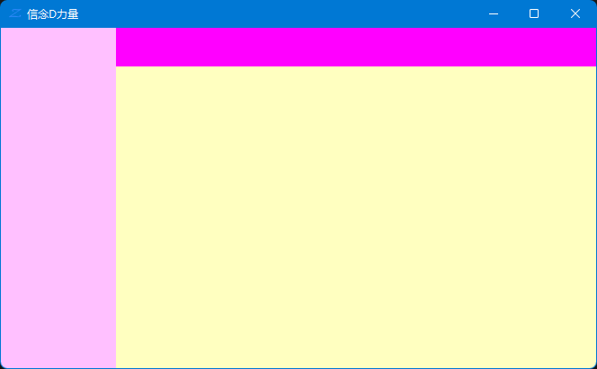

# WinForm 桌面开发

## MessageBox

在测试时我们可能会用到 `MessageBox` 来弹出一个窗口显示一些我们要显示的数据。

这个对象的 `Show()` 方法有多个重载，调用相应的方法可以显示不同的方式。

## 显示时间
这个例子一共使用了两个控件，一个按钮和一个文本框。实现的功能是点击按钮然后让文本框中显示当前时间。

```csharp
private void OnShowTimeClicked(object sender, EventArgs e)
{
    string time = DateTime.Now.ToString("yyyy-MM-dd HH:mm:ss");
    textBox_Time.Text = time;
}
```

## 控件布局

- 可视化布局
- 手工布局
- 布局器布局

### anchor 锚定
Anchor 可以让控件固定显示的位置，使用的方法是先把控件拉倒想要显示的位置，然后设置相应的 Anchor 就可以实现在窗口大小变化时控件的相对位置不变。

#### 几种常用的固定位置
- 固定到左上、右上、左下、右下角。
- 固定到上中、左中、下中、右中、中心

### Dock 停靠
Dock 可以让一个控件停靠在上、下、左、右、中五个位置。

以在窗口中放置三个 `Panel` 为例，实现上左中布局，只要分别设置三个 `Panel` 的 `Dock` 为上、左、中即可。



#### 左右布局
左右布局实际上是先把一个 `Panel` 靠左停靠，然后让另一个靠中间停靠，最后再在中间的 `Panel` 中放置一个 `Panel` 并且停靠在顶部。


### 布局器 LayoutEngine

布局器 `LayoutEngine` 负责子控件的布局。

#### 自定义布局器

#### FlowLayoutPanel 布局面板

FlowLayoutPanel 布局面板有一个 `FlowDirection` 属性，改属性可以控制子控件的排列方式，一共有4种。
- LeftToRight
- TopDown
- RightToLeft
- BottomUp

#### TableLayoutPanel 布局面板

对表格布局的常用操作有添加行列和删除行列，常用的属性有：
