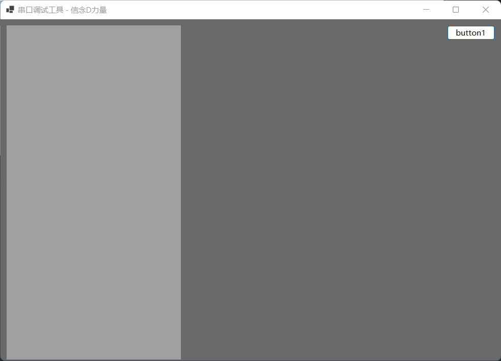

# 基础知识

## Anchor 属性

`Anchor` 的中文翻译是锚点，就是定位的意思。

在 `WinFrom` 中控件的 `Anchor` 属性是用来定位控件的位置的。

使用注意事项：

一旦对控件使用了 `Anchor` 属性，那么这个控件就是以当前的位置状态来相对于父容器控件的确定的。

### 按钮定位的例子

首先在窗口的右上角放置一个按钮，然后设置 `Anchor` 属性为：`Top, Right`。这样随着窗口的变化按钮就能始终保持在右上角了。

## Dock 属性
