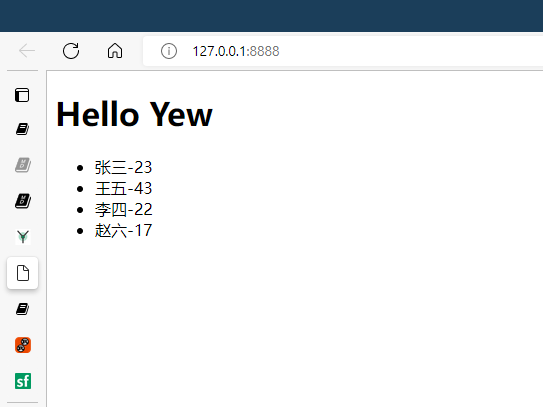

这是 Yew 编程笔记文档

Yew 的官网地址 [yew.rs](https://yew.rs/).

## 使用 Yew 的步骤

* 安装 trunk
* 添加 yew 依赖
* 设置构建目标

## 第一个 Yew 例子

### 依赖安装

```toml
[package]
name = "yew-app"
version = "0.1.0"
edition = "2021"

# See more keys and their definitions at https://doc.rust-lang.org/cargo/reference/manifest.html

[dependencies]
yew = "0.19"
```

### src/main.rs

```rust
use yew::prelude::*;

#[function_component(App)]
fn app() -> Html {
    html! {
        <h1>{ "Hello World" }</h1>
    }
}

fn main() {
    yew::start_app::<App>();
}
```

## 在项目根目录创建 index.html

```html
<!DOCTYPE html>
<html lang="en">
    <head> </head>
    <body></body>
</html>
```

启动开发服务器

```shell
trunk serve --open --port 8888
```

## 在 rust 中写 html

要在 rust 写 html 需要用到 `html! {}` 宏，例子如下：

```rust
html! {
    <>
        <h1>{ "RustConf Explorer" }</h1>
        <div>
            <h3>{"Videos to watch"}</h3>
            <p>{ "John Doe: Building and breaking things" }</p>
            <p>{ "Jane Smith: The development process" }</p>
            <p>{ "Matt Miller: The Web 7.0" }</p>
            <p>{ "Tom Jerry: Mouseless development" }</p>
        </div>
        <div>
            <h3>{ "John Doe: Building and breaking things" }</h3>
            
        </div>
    </>
}
```

在 rust 的 html! 宏中只能有一个根节点，所以需要用 <> </>作为空节点。

## 用 rust 构建 html 中需要的元素

```rust
use gloo::console::log;

use yew::prelude::*;

#[derive(Properties, PartialEq)]
struct MyObject {
    username: String,
    age: u32,
}

#[function_component(App)]
pub fn app() -> Html {
    let mut users = vec![
        MyObject {
            username: "张三".to_string(),
            age: 23,
        },
        MyObject {
            username: "王五".to_string(),
            age: 43,
        },
        MyObject {
            username: "李四".to_string(),
            age: 22,
        },
        MyObject {
            username: "赵六".to_string(),
            age: 17,
        },
    ];

    let users = users
        .iter()
        .map(|user| {
            html! {
                <li>{user.username.to_string()} {"-"} {user.age}</li>
            }
        })
        .collect::<Html>();

    html! {
        <>
            <h1 class="title">{"Hello Yew"}</h1>
            <ul>{users}</ul>
        </>
    }
}
```


